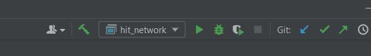
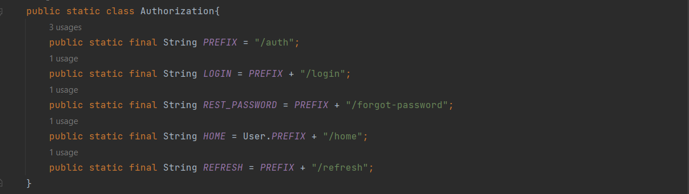
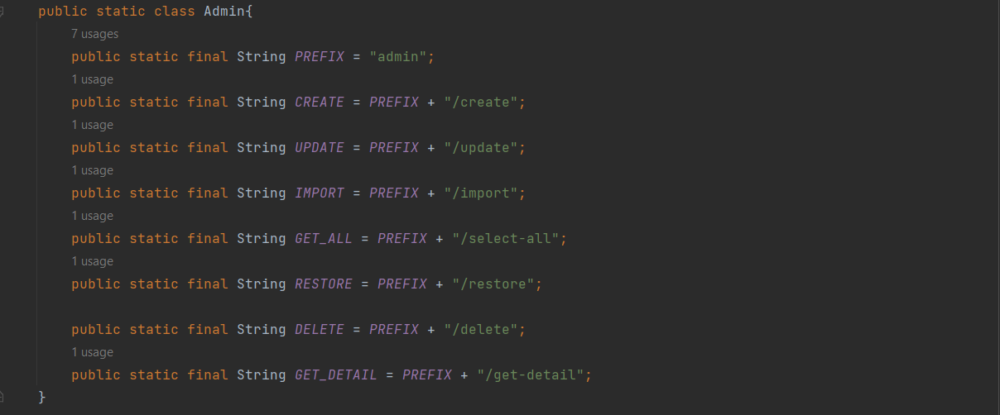
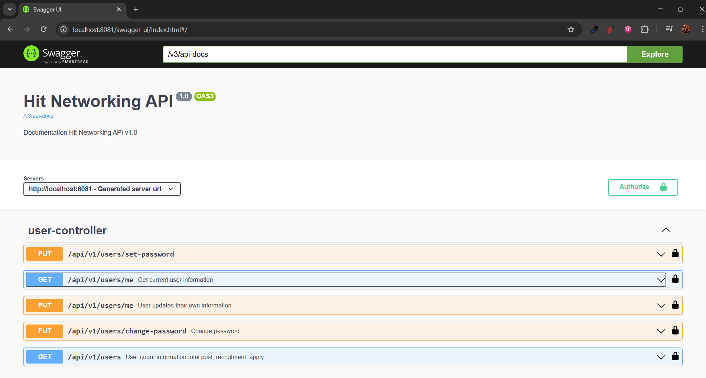

# Nhóm HIT-FireFlies

---

# 🧑‍💻 Giới thiệu dự án

- Web HIT Network hướng tới việc xây dựng một hệ thống hỗ trợ kết nối nội bộ chuyên nghiệp

---

# 🤖Các chức năng chính

Backend của dự án **HIT-Networking**, cung cấp REST API cho các chức năng:

- Đăng ký, đăng nhập, xác thực bằng JWT
- import danh sách tài khoản từ file Excel
- Quản lý người dùng
- Tạo & quản lý bài viết (sự kiện, tuyển dụng)
- Thả reaction, bình luận
- Apply vào bài tuyển dụng
- Gửi thông báo về email khi có bài đăng mới

---

# 🚀 Công nghệ sử dụng

- **Java 11**
- **Spring Boot 3**
- **Spring Security**
- **Spring Data JPA / Hibernate**
- **MySQL 8**
- **Maven**
- **Swagger**
- **Postman**
- **Docker** + **Render**

---

# 📦 Yêu cầu cài đặt hệ thống

- **IDE**: Intellij Community
- **Java**: 17+
- **Maven**: 3.9+
- **MySQL**: 8+
- **Docker desktop**

---

# 📂 Cấu trúc thư mục

```
src/
├── main/
│ ├── java/com/example/hit_networking_base
│ │ ├── base           # Các base dùng chung cho controller
│ │ ├── config         # Cấu hình Cloudinary, JWT properties, OpenApi, Dotenv,...
│ │ ├── constant       # Cấu hình các enum, url Constant
│ │ ├── controller     # REST API Controller
│ │ ├── domain
│ │ │  ├── dto         # Data Transfer Object
│ │ │  │  ├── request  # Dữ liệu nhận vào
│ │ │  │  ├── response # Dữ liệu trả lại
│ │ │  ├── entity      # Các entiry của ứng dựng
│ │ │  ├── mapstruct   # Map dto với entity
│ │ ├── exception      # Xử lý lỗi
│ │ └── repository     # JPA Repository
│ │ └── security       # Cấu hình security
│ │ └── service        # Các hàm xử lý logic
│ │ │  ├── impl        # Các thực hiện của các hàm xử lý logic
│ │ └── util           # Cấu hình các hàm hỗ trợ
│ └── resources/
│    ├── application.properties
.env

```

---

# ⚙️ Cài đặt & Chạy dự án

1️⃣ Clone dự án

```bash
git clone https://github.com/quynh150105/HIT-FireFlies.git
```

2️⃣ Cấu hình database

- Mở file .env và chỉnh thông tin các biến môi trường

```
POST= your_post

# --- DATABASE --
DB_URL= your_database_url
DB_USERNAME= your_database_username
DB_PASSWORD= your_database_password
HB_DIALECT= your_hibernate_dialect_url

# --- ADMIN DEFAULT ACCOUNT ---
ADMIN_USERNAME= your_admin_username
ADMIN_PASSWORD= your_admin_password

# --- JWT ---
JWT_SECRET= your_jwt_secret
JWT_ACCESS_EXPIRATION=
JWT_REFRESH_EXPIRATION=

# --- MAIL ---
MAIL_HOST= your_mail_host
MAIL_PORT= your_mail_post
MAIL_USERNAME= your_email
MAIL_PASSWORD= your_app_password

# --- CLOUDINARY ---
CLOUDINARY_CLOUD_NAME= your_cloudinary_name
CLOUDINARY_API_KEY= your_cloudinary_api_key
CLOUDINARY_API_SECRET= your_cloudinary_secret_key

# --- SWAGGER ---
API_TITLE= your_title
API_VERSION= your_api_version
API_DESCRIPTION= your_api_description
API_SERVER_URL= your_api_server_url
API_SERVER_NAME= your_api_server_name

VISION_KEY_BASE64= your_vision_key_base64

BLACKLIST= your_blacklist

```

- Cấu hình trong file application.properties

```
# --- DATABASE ---
server.port=${PORT}
spring.datasource.url=${DB_URL}
spring.datasource.username=${DB_USERNAME}
spring.datasource.password=${DB_PASSWORD}
spring.datasource.driver-class-name=${DB_DRIVER}


#JPA / HIBERNATE
spring.jpa.show-sql=true
spring.jpa.properties.hibernate.format_sql=true
spring.jpa.properties.hibernate.use_sql_comments=true
spring.jpa.hibernate.ddl-auto=update
spring.jpa.properties.hibernate.dialect=${HB_DIALECT}


# --- ADMIN DEFAULT ACCOUNT ---
admin.username=${ADMIN_USERNAME}
admin.password=${ADMIN_PASSWORD}

# --- JWT ---
jwt.secret=${JWT_SECRET}
jwt.accessExpirationTime=${JWT_ACCESS_EXPIRATION}
jwt.refreshExpirationTime=${JWT_REFRESH_EXPIRATION}

# --- MAIL ---
spring.mail.host=${MAIL_HOST}
spring.mail.port=${MAIL_PORT}
spring.mail.username=${MAIL_USERNAME}
spring.mail.password=${MAIL_PASSWORD}
spring.mail.properties.mail.smtp.auth=true
spring.mail.properties.mail.smtp.starttls.enable=true

# --- CLOUDINARY ---
cloudinary.cloud_name=${CLOUDINARY_CLOUD_NAME}
cloudinary.api_key=${CLOUDINARY_API_KEY}
cloudinary.api_secret=${CLOUDINARY_API_SECRET}

# --- FILE UPLOAD SIZE LIMIT ---
spring.servlet.multipart.max-file-size=10MB
spring.servlet.multipart.max-request-size=10MB

# --- SWAGGER ---
open.api.title=${API_TITLE}
open.api.version=${API_VERSION}
open.api.description=${API_DESCRIPTION}
open.api.serverUrl=${API_SERVER_URL}
open.api.serverName=${API_SERVER_NAME}

VISION_KEY_BASE64=${VISION_KEY_BASE64}
black.list=${BLACKLIST}
```

3️⃣ Chạy ứng dụng

Nhấn nút run trên thanh công cụ

## 

---

# 🔐 Xác thực & phân quyền (Authentication & Authorization)

- Basic Auth
- Quản lý token
- Role-based access

---

# 🔍 API endpoint chính (Key API Endpoints)

- Một số các endpoint đáng chú ý

  - endpoint Authorization

  ## 

  - endpoint của admin

  ## 

---

# 📑 API Documentation

### Swagger UI: http://localhost:8081/swagger-ui/index.html

- giao diện chính của Swagger

  

---

# 🛠 Cách đóng góp

- Tạo branch mới: git checkout -b feature/ten-tinh-nang

- Commit thay đổi: git commit -m "Add feature"

- Push lên branch: git push origin feature/ten-tinh-nang

- Tạo Pull Request

---

# 📄 Giấy phép (License)

Dự án phát hành dưới giấy phép của HIT 🔥. Xem chi tiết tại [LICENSE](./LICENSE).
